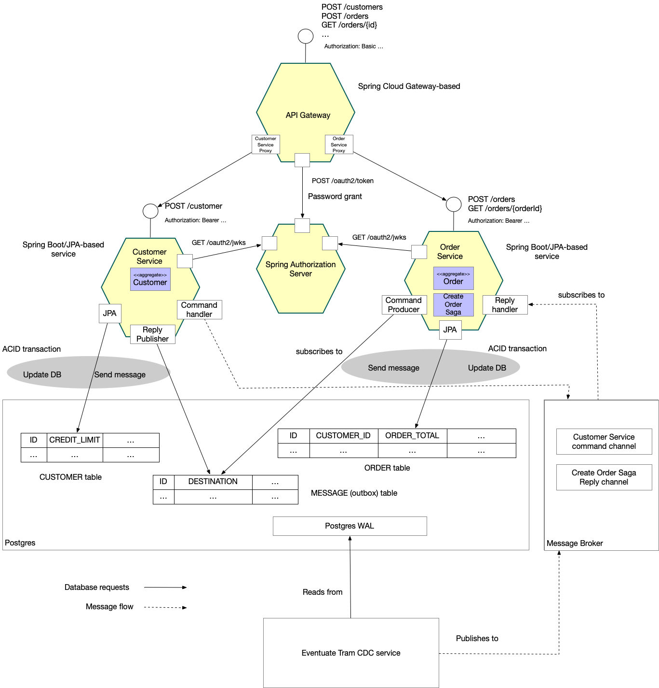

= An Eventuate project

image::https://eventuate.io/i/logo.gif[]

This project is part of http://eventuate.io[Eventuate], which is a microservices collaboration platform.

= Eventuate Tram Sagas Customers and Orders: using orchestration-based sagas

This application demonstrates how to implement an orchestration-based http://microservices.io/patterns/data/saga.html[saga].

The following diagram shows the architecture of the Customers and Orders application.

The application consists of the following services:

* `Customer Service` - manages customers.
The service persists the `Customer` JPA entity in a MySQL/Postgres database.
Using the https://github.com/eventuate-tram/eventuate-tram-sagas[Eventuate Tram Saga framework], it processes command messages, updates its the `Customer` entity, and sends back a reply message.

* `Order Service` - manages orders.
The service persists the `Order` JPA entity and the `CreateOrderSaga` in MySQL/Postgres database.
Using the https://github.com/eventuate-tram/eventuate-tram-sagas[Eventuate Tram Saga framework], it sends command messages and processes replies.

* `API Gateway` - a Spring Cloud Gateway-based API Gateway that routes requests to the appropriate service

* `Spring Authorization Service` - used by the `API Gateway` to authenticate requests and obtain a JWT that's passed to the `Customer Service` and `Order Service`

* `Eventuate Tram CDC service` reads messages from the [outbox table](https://microservices.io/patterns/data/transactional-outbox.html) and publishes messages to Apache Kafka.

== About sagas

The `Order Service` uses an orchestration-based saga to enforce the customer's credit limit when creating orders.

http://microservices.io/patterns/data/saga.html[Sagas] are a mechanism for maintaining data consistency in a http://microservices.io/patterns/microservices.html[microservice architecture].
A saga is a sequence of transactions, each of which is local to a service.

There are two main ways to coordinate sagas: orchestration and choreography.
Please see https://github.com/eventuate-tram/eventuate-tram-examples-customers-and-orders[example] to learn about choreography-based sagas.
This example uses orchestration-based sagas, where a saga (orchestration) object invokes the participants.

A saga orchestrator is a persistent object that does one of two things:

1. On startup, it sends a command message to a participant
2. When it receives a reply, it updates its state and sends a command message to the next participant.

To learn more about why you need sagas if you are using microservices:

* the http://microservices.io/patterns/data/saga.html[Saga pattern]
* my http://microservices.io/microservices/general/2018/03/22/microxchg-sagas.html[microXchg 2018 presentation]
* read about sagas in my https://www.manning.com/books/microservice-patterns[Microservice patterns book]

== The `Create Order Saga`

The following diagrams shows how the saga for creating an `Order` works:

image::./images/Orchestration_flow.jpeg[]

It consists of the follow steps:

. The `Order Service` creates a `CreateOrderSaga` to coordinate the creation of the order.
. The `CreateOrderSaga` creates an `Order` in a `PENDING` state
. The `CreateOrderSaga` sends a `reserveCredit` command to the `CustomerService`
. The `Customer Service` receives the command and attempts to reserve credit for that `Order`. It replies with a message indicating the outcome.
. The `CreateOrderSaga` receives the reply
. It send either an `ApproveOrder` or a `RejectOrder` command to the `OrderService`
. The `Order Service` receives the command and changes state of the order to either `APPROVED` or `REJECTED`.

== Building and running

This application requires Java 17.

To run the application, simply execute the following command `./gradlew runApplication`.
This command uses the Testcontainers framework to run the services on randomly assigned ports.

Once the services have started, `runApplication` shows the URL of a web page that displays information about how to use the application.

=== Running end to end tests

There are two Gradle tasks for running end to end tests:

* `./gradlew endToEndTests` - runs the tests using test containers
* `./gradlew endToEndTestsUsingKind` - runs the tests assuming that the application is already running in a Kind-based Kubernetes cluster, e.g. external traffic port is specified by the `API_GATEWAY_PORT` environment variable and defaults to 8080

In order to always run the tests, these tasks first run the `:end-to-end-tests:clean` task and disable Gradle's build caching.

=== Building container images

There are two Gradle tasks for building container images:

* `buildDockerImageLocally` - builds and pushes images to a locally running registry. You must specify the `imageVersion` Gradle property. e.g. `localhost:5002/order-service:<imageVersion>`
* `buildDockerImageRemote` - builds and pushes images to a remote registry. You must specify the `imageRemoteRegistry` and `imageVersion` Gradle properties. e.g. <imageRemoteRegistry>/order-service:<imageVersion>`

== Got questions?

Don't hesitate to create an issue or see

* https://groups.google.com/d/forum/eventuate-users[Mailing list]
* https://eventuate-users.slack.com[Slack]. https://eventuateusersslack.herokuapp.com/[Get invite]
* http://eventuate.io/contact.html[Contact us].
